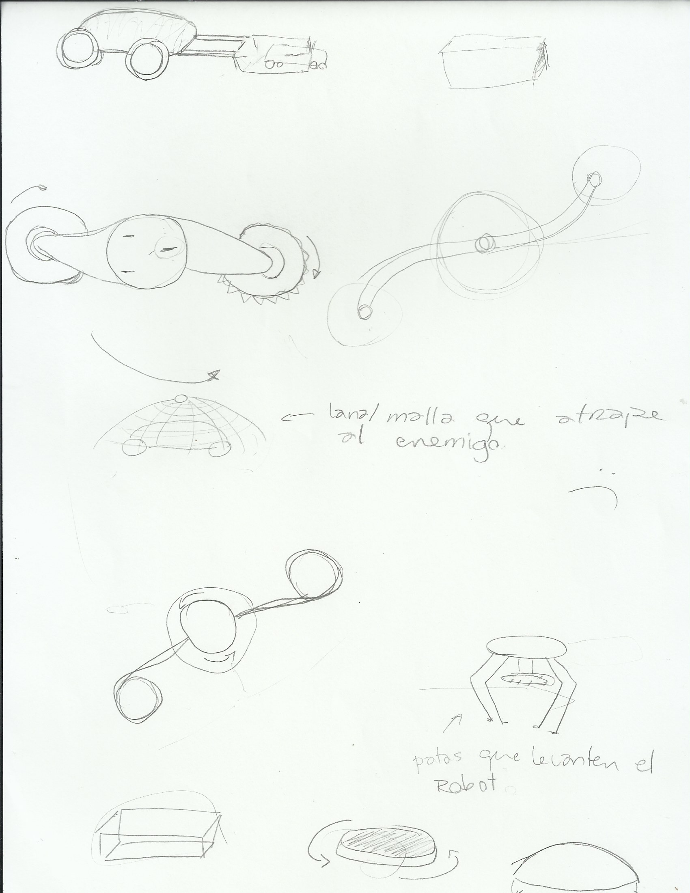
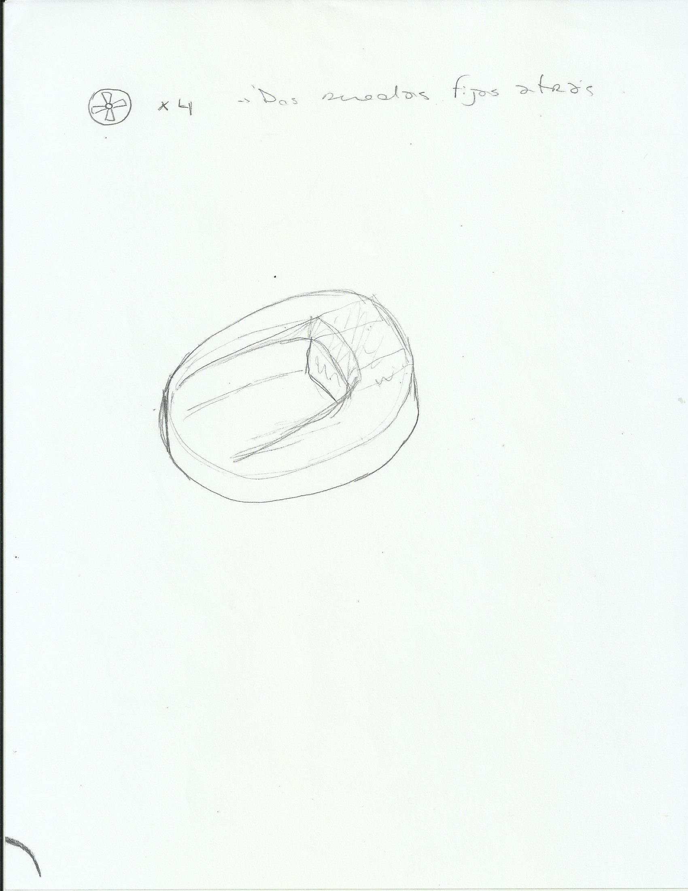
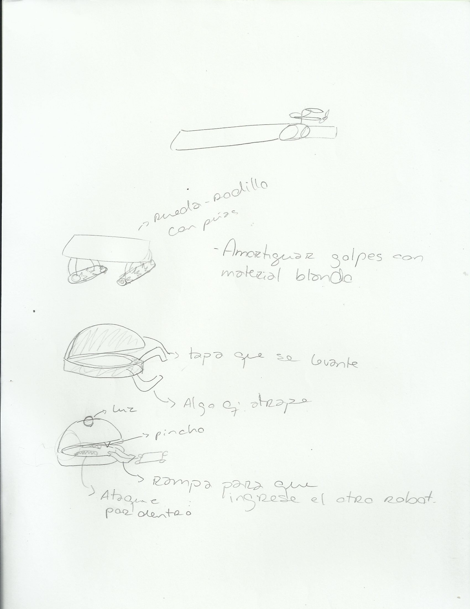
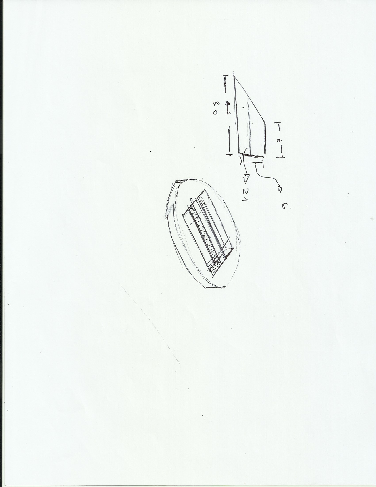
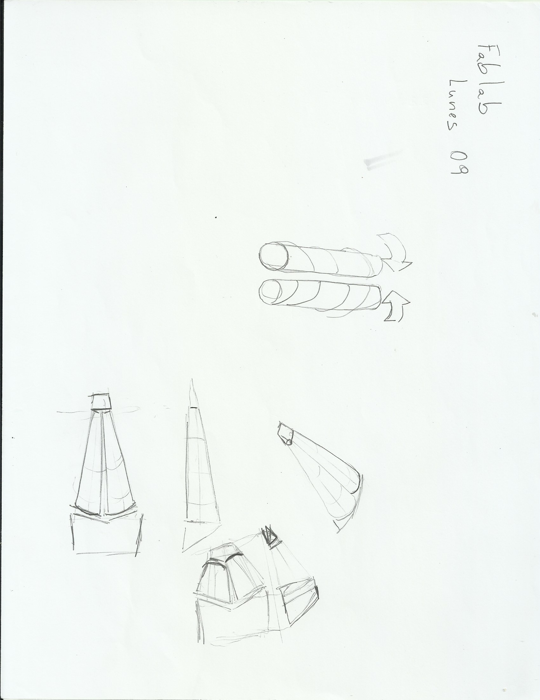
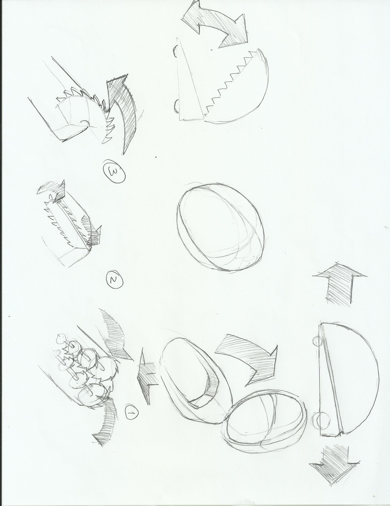
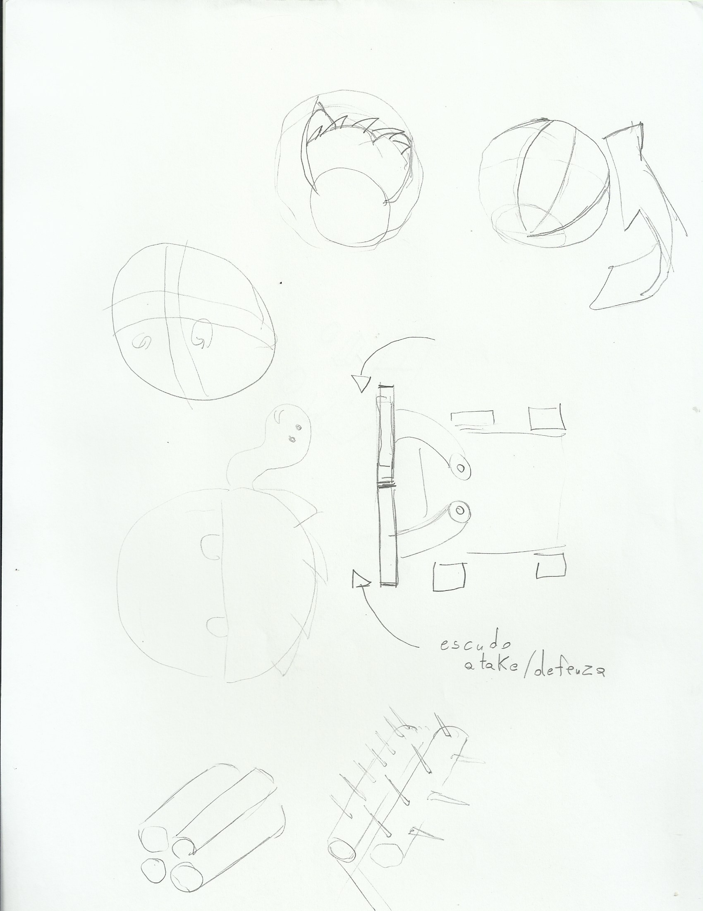
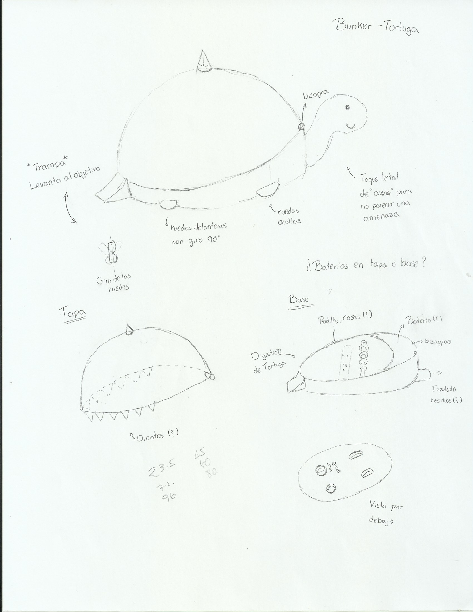

# Lluvia de Ideas

Todos estos son sketches del Brainstorming inicial al momento de pensar en como sería el robot (hasta el momento sin nombre).
Las ideas varían bastante, sin embargo el enfoque central converge a un armadillo o una tortuga por su buena defensiva

## Sketches

Entre las primeras ideas, estaba un robot que pudiera levantar a los demás y mandarlos a volar, otra opción era un sistema de giro constante, como un fidget spinner. También, se consideró un robot que pudiera moverse incluso dado vuelta, de modo que si nos volteaban no fuera un problema. Por otro lado, se pensó hacer un robot que en vez de moverse con ruedas, caminara. 

Aquí se define una especie de base para el robot.

En este momento comienza a considerarse la idea de algo con buena defensa, y armas tales como un rodillo o sierras.

Nuevas ideas para sistemas de ataque, rodillos con forma cónica.

Surge la idea de una especie de pacman, algo que se trague a los demas robots y los destruya en su interior.

También se considera la idea de un armadillo, el enfoque se centra en la defensa.

Finalmente, el enfoque se va hacia una tortuga
